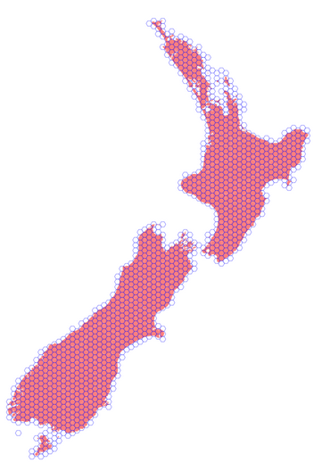

Geohexgrid
**********
A Python 3.9+ library for making geographic hexagon grids like QGIS's `create grid function <https://docs.qgis.org/3.22/en/docs/user_manual/processing_algs/qgis/vectorcreation.html?highlight=create%20grid#create-grid>`_.
Not designed for making `discrete global grid systems <https://en.wikipedia.org/wiki/Discrete_global_grid>`_ like Uber's H3.

Here's an example of its main use, namely, minimally covering a GeoDataFrame of features with a flat-top hexagon grid of given resolution.

.. code-block:: python

  import geopandas as gpd
  import geohexgrid as ghg

  # Load New Zealand territorial authorities projected in EPSG 2193 (NZTM)
  shapes = gpd.read_file(DATA_DIR / "nz_tas.gpkg")

  # Cover it minimally with hexagons of circumradius 10 kilometres
  grid = ghg.make_grid(shapes, 10_000, intersect=True)

  # Plot
  base = shapes.plot(color='red', figsize=(20, 20), aspect="equal")
  grid.plot(ax=base, color='white', edgecolor="blue", alpha=0.5)

Contributors
============
- Alex Raichev (2014-09), maintainer

Installation
============
Install from PyPI, e.g. via ``poetry add geohexgrid``.

Examples
=========
See the Jupyter notebook at ``notebooks/examples.ipynb``.

Notes
======
- This project's development status is Alpha.
  Alex uses this project for work and changes it breakingly when it suits his needs.
- This project uses semantic versioning.
- Thanks to `MRCagney <https://mrcagney.com>`_ for periodically funding this project.
- Red Blog Games has a `great write up of non-geographic hexagon grids <https://www.redblobgames.com/grids/hexagons>`_.
- Alex wanted to chose a shorter name for this package, such as 'hexgrid', 'geohex', or 'hexcover', but those were already taken or too close to taken on PyPI.

Changes
=======

1.0.0, 2022-08-15
-----------------
- First release.