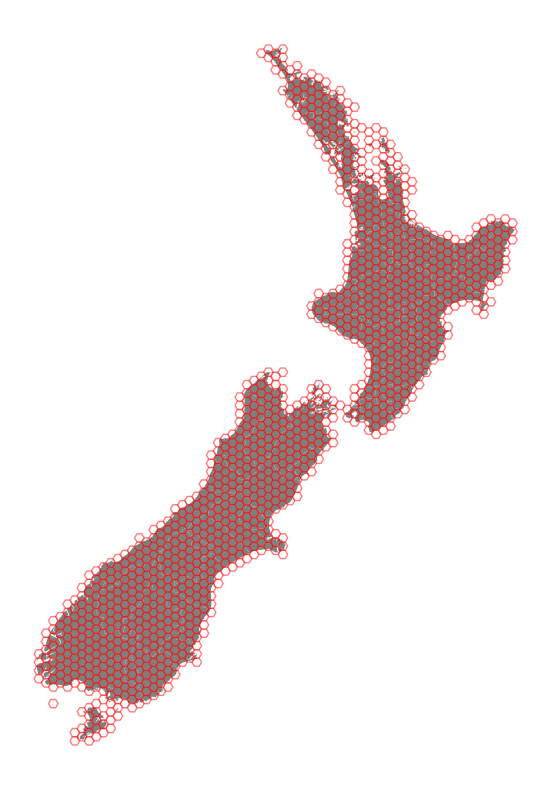

Geohexgrid
**********
.. image:: https://github.com/mrcagney/geohexgrid/actions/workflows/test.yml/badge.svg
   :target: https://github.com/mrcagney/geohexgrid/actions/workflows/test.yml

A tiny Python 3.10+ library for making geographic flat-top hexagonal grids like QGIS's `create grid function <https://docs.qgis.org/3.22/en/docs/user_manual/processing_algs/qgis/vectorcreation.html?highlight=create%20grid#create-grid>`_.
That's it.
Not designed for making other kinds of grids or `discrete global grid systems <https://en.wikipedia.org/wiki/Discrete_global_grid>`_.

Here a **hexagonal grid**, or **hex grid** for short, is a finite subset of a hexagonal tiling.
A hexagonal tiling is a covering of the plane with regular hexagons in which exactly three hexagons meet at each vertex.
(For more details, see `the Wikipedia article on hexagonal tilings <https://en.wikipedia.org/wiki/Hexagonal_tiling>`_.)
The **circumradius** of a hex grid is the circumradius of any one of its hexagons, that is, the radius of a circle circumscribing any one of the hexagons.
This library favours the word 'grid' over 'tiling', because 'grid' is used more often in geographic context, the main context of this library.

The two main features of this library are

- Making a flat-top hexagonal grid of given circumradius that minimally covers a GeoDataFrame of features, where distance units come from the GeoDataFrame's coordinate reference system (CRS), e.g. no units for no CRS, metres for the New Zealand Transverse Mercator (NZTM) CRS, and decimal degrees for the WGS84 CRS.
- By default, hex grids made with a common CRS and circumradis share an origin and thus have equal hexagons (and hexagon IDs) where they overlap.
  In other words, the grids share a single (infinite) hexagonal tiling of the plane, which is useful when reconciling multiple grids across different geographic areas.

The main non-feature of this library is

- Making any other kind of grid, e.g. ones with pointy-top hexagons, squares, triangles, kisrhombilles, Penrose tiles...

Here's a typical example.

.. code-block:: python

  import geopandas as gpd
  import geohexgrid as ghg

  # Load New Zealand territorial authorities projected in EPSG 2193 (NZTM)
  nz = gpd.read_file(DATA_DIR / "nz_tas.gpkg")

  # Cover it minimally with hexagons of circumradius 10 kilometres
  grid = ghg.make_grid_from_gdf(nz, R=10_000)

  # Plot
  base = nz.plot(color="black", figsize=(10, 10), aspect="equal")
  grid.plot(ax=base, color="white", edgecolor="red", alpha=0.5)

But why hexagons?!
Because `hexagons are the bestagons <https://www.youtube.com/watch?v=thOifuHs6eY>`_.
More seriously, no one grid type works best for all geographic applications.
MRCagney, this library's funder, often works with isochrones, which favour simple convex equal area grids with equidistant neighbour cells, that is, hex grids.

Authors
============
- Alex Raichev (2014-09), maintainer

Installation
============
Install from PyPI, e.g. via ``uv add geohexgrid``.

Examples
=========
See the Jupyter notebook at ``notebooks/examples.ipynb``.

Notes
======
- This project's development status is Alpha.
  Alex uses this project for work and changes it breakingly when it suits his needs.
- This project uses semantic versioning.
- Thanks to `MRCagney <https://mrcagney.com>`_ for periodically funding this project.
- Red Blog Games has a `great write up of hexagonal grids <https://www.redblobgames.com/grids/hexagons>`_ for computer games.
- Alex wanted to chose a shorter name for this package, such as 'hexgrid', 'geohex', or 'hexcover', but those were already taken or too close to taken on PyPI.

Changes
=======

2.1.1, 2025-03-07
-----------------
- Removed unused Loguru import in ``main.py``.
  This was preventing users from installing Geohexgrid, because Loguru is only a development dependency.

2.1.0, 2024-09-26
-----------------
- Bugfixed ``make_grid_from_bounds`` in response to `Issue 2 <https://github.com/mrcagney/geohexgrid/issues/2>`_.
- Switched from Poetry to UV for project management.
- Bumped Python version up to 3.10+.

2.0.0, 2023-11-14
-----------------
- Refactored for simpler architecture, gapless grids, and a ~15x speed up in the main function ``grid_from_gdf``.

1.1.0, 2023-10-27
-----------------
- Added the ``clip`` option to the function ``grid_from_gdf``.
- Updated dependencies.
- Re-ordered functions.
- Changed the cell ID separotor to a comma.

1.0.0, 2022-08-15
-----------------
- First release.